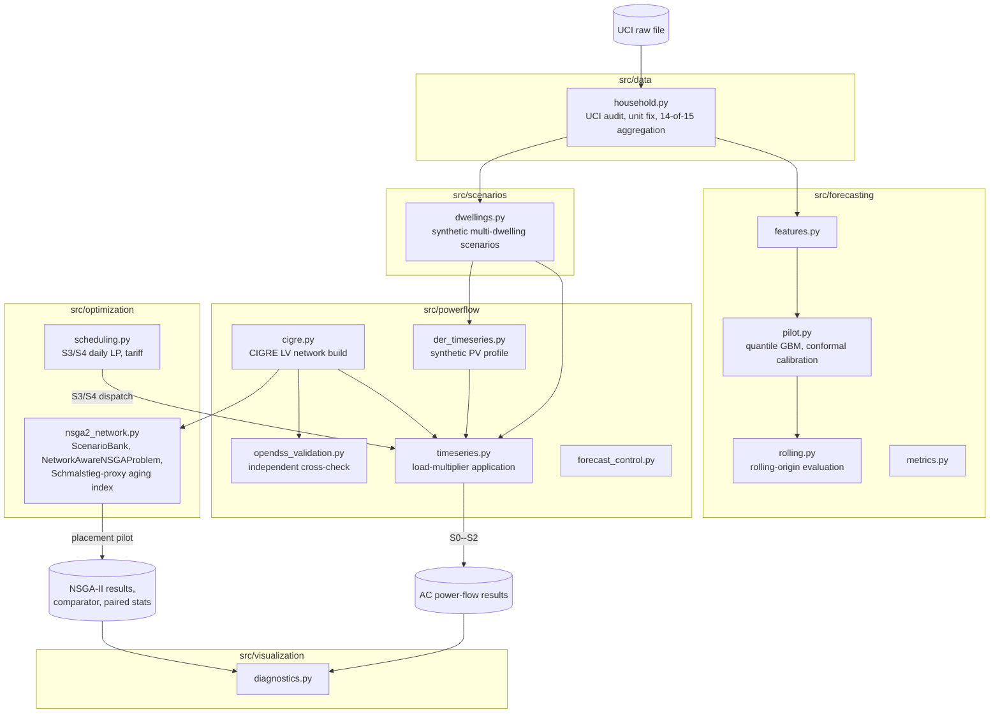
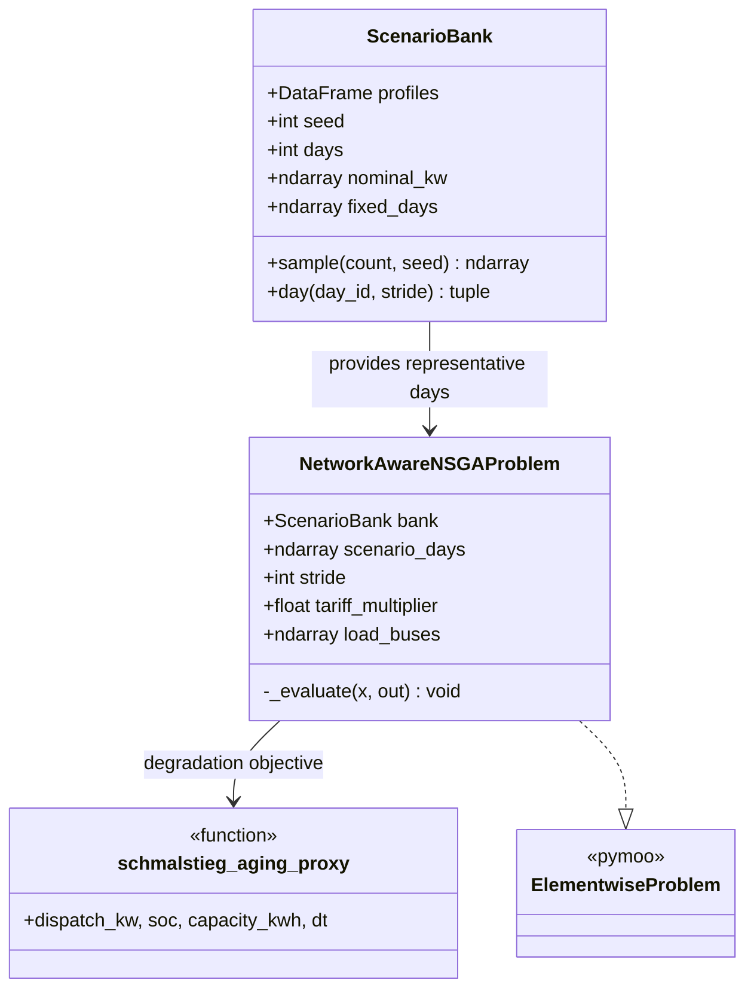

# Uncertainty-Aware Residential Load Forecasting and Probabilistic Power Flow (CIGRE LV)

Reproducible research code for propagating uncertainty from a measured residential load series, through synthetic dwelling scenarios, to independently validated time-series AC power flow on the CIGRE low-voltage benchmark, with rule-based, forecast-informed and network-aware PV--battery coordination.

This repository is the **code and reproducibility project only**. It does not contain the manuscript.

## What this project does

1. Audits and cleans a minute-resolution UCI household power-consumption file (missing-data handling, unit correction, checksum).
2. Trains a direct quantile gradient-boosting forecaster at 15-min/1-h/6-h/24-h horizons, with split-conformal calibration and quarterly rolling-origin evaluation.
3. Builds synthetic multi-dwelling scenarios from the single measured series (block resampling with common-day correlation, log-normal amplitude, AR(1) residual).
4. Instantiates the CIGRE low-voltage benchmark in `pandapower` and independently cross-validates it against `OpenDSSDirect`.
5. Runs five operational cases (S0 load-only, S1 50% PV, S2 rule-based PV+battery, S3 point-forecast daily LP, S4 quantile-envelope daily LP) over 100 common synthetic days, plus three controlled one-day outage replays (E0--E2).
6. Runs a network-aware NSGA-II pilot that places and sizes one additional residential PV--battery site against five objectives (cost, losses, voltage deviation, transformer peak, degradation), with an independently implemented comparator and paired statistical testing (Wilcoxon signed-rank, sequential Holm--Bonferroni, signed rank-biserial effect size) against S2--S4.

## Architecture



`scripts/run_*.py` are thin CLI entry points over `src/`; each writes its outputs under `results/`. See [Reproducing the pipeline](#reproducing-the-pipeline) for the exact command sequence.

### NSGA-II placement pilot (class structure)



`NetworkAwareNSGAProblem` decodes a chromosome (bus placement among the six residential sites, battery energy/power, PV rating, 96 dispatch commands, 96 curtailment fractions) into a per-step AC power-flow evaluation and returns five objectives plus four constraint-violation magnitudes; see the module docstring for the exact equations and the fixes applied on 2026-09-05 (day/stride scope, time-step scaling, aging-index counting, transformer-loading aggregation, placement bounds).

## Data

The raw UCI "Individual household electric power consumption" file is **not included** (license/size). Place the unmodified file at `data/raw/household_power_consumption(1).txt` (or point `--input` / `configs/data.yaml: raw_path` elsewhere); it is git-ignored. Processed/interim data are regenerated by the scripts and are also git-ignored.

## Setup

```bash
python3 -m venv .venv
source .venv/bin/activate
pip install -r requirements.txt
pytest -q
```

## Reproducing the pipeline

```bash
python scripts/run_data_audit.py --input "data/raw/household_power_consumption(1).txt"
python scripts/run_forecasting_pilot.py
python scripts/run_rolling_origin.py
python scripts/run_diagnostics_and_scenarios.py
python scripts/run_cigre_base.py
python scripts/run_opendss_validation.py
python scripts/run_cigre_timeseries.py
python scripts/run_der_scenarios.py
python scripts/run_forecast_schedules.py
python scripts/run_forecast_control_powerflows.py
python scripts/compare_der_scenarios.py
python scripts/run_contingency_pilot.py
python scripts/summarize_cigre_s0.py

# Network-aware NSGA-II pilot (corrected 2026-09-05: residential-only
# placement, 4 representative days, hourly resolution, 5 seeds)
python scripts/run_nsga_experiment.py --population 12 --generations 20 --seeds 5 --scenario-count 50 --days 100 --base-only
python scripts/fix_nsga_statistics.py
python scripts/run_independent_comparator.py
python scripts/run_tariff_sensitivity.py
```

`make pilot` / `make cigre` provide equivalent shortcuts where a Makefile target exists. All outputs land under `results/`; raw data are never modified. Seed `20260904` controls the synthetic-scenario construction throughout (see `configs/*.yaml`).

## Reproducibility status

- **Data audit**: reproduced from the supplied external file; SHA-256 recorded under `results/metrics/`.
- **CIGRE LV benchmark**: independently validated between `pandapower` (Newton--Raphson and backward/forward sweep) and `OpenDSSDirect` (max. bus-voltage disagreement $4.61\times10^{-6}$ p.u.).
- **S0--S4**: complete over 100 common synthetic days (9,600 AC solves each). E0--E2 controlled outage replay: complete (288 AC solves).
- **NSGA-II network-aware placement pilot**: complete at a disclosed reduced scale (4 representative days, hourly resolution, population 12, 20 generations, 5 independent seeds) after fixing several evaluator defects found in an earlier 30-seed screening attempt (documented in `ESTADO_ENTREGA.md` and in the module docstrings): day/stride truncation mismatched with the S0--S4 basis, a time-step scaling error in the SOC/energy accounting, an aging-index that counted un-dispatched chromosome entries, a transformer-loading objective that summed rather than maximized per-step values, and a placement search that spanned industrial/commercial buses far smaller than the sized DER. The corrected pilot's retained candidates are paired (Wilcoxon signed-rank, sequential Holm--Bonferroni, signed rank-biserial effect size) against S2--S4 on the same days; see `results/optimization/paired_policy_statistics.csv`.
- **Outstanding**: the full 100-day/15-min evaluation basis, 30 independent seeds, PV-penetration/storage-duration sensitivities (S6), and an independently calibrated battery-degradation model (S5) remain to be run.

## Repository layout

```
configs/      YAML configuration (data, forecasting, network, optimization, scenarios)
src/          Library code (data, forecasting, scenarios, powerflow, optimization, visualization)
scripts/      CLI entry points that orchestrate src/ and write results/
tests/        Unit/integration tests (pytest)
results/      Generated metrics, simulations, tables and optimization outputs (git-tracked; raw/interim/processed data are not)
data/         Raw/interim/processed data directories (contents git-ignored except .gitkeep)
```

## Environment

Python 3.10+. Key pinned dependencies (see `requirements.txt` / `environment.yml`): `pandapower==3.5.4`, `OpenDSSDirect.py==0.9.4`, `pymoo==0.6.2`, `numpy`, `pandas`, `scipy`, `scikit-learn`, `statsmodels`.

## License

Not yet specified. If you intend others to reuse this code, add a `LICENSE` file (e.g., MIT or Apache-2.0) before relying on this repository being open for reuse -- with no license, default copyright applies and no reuse rights are granted.
